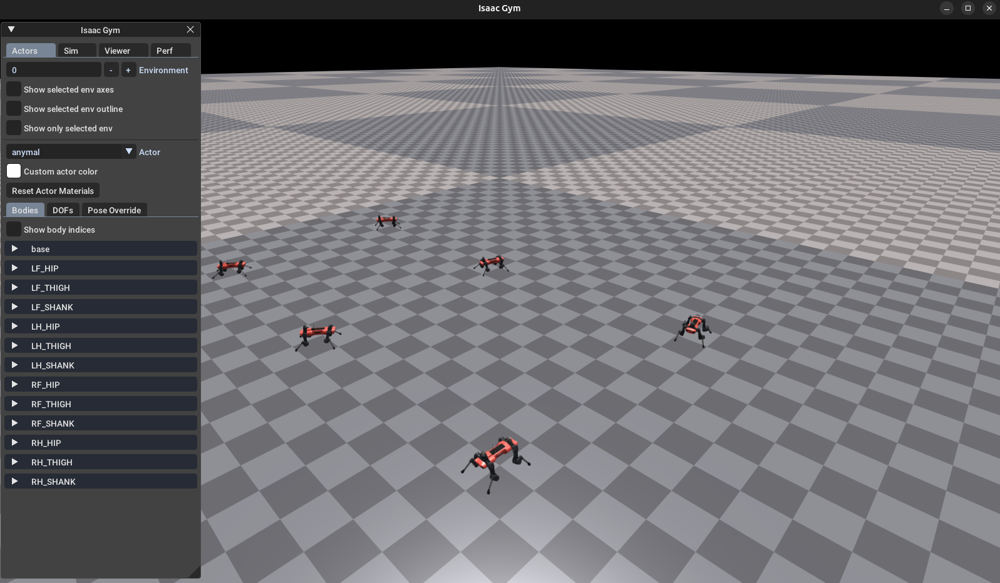
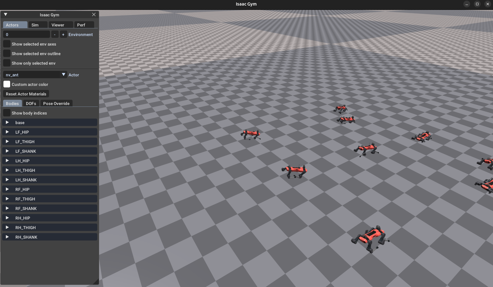

# IsaacGym 

Testing with the IsaacGym basic templates.


### Results 
----
1) Main IsaacGym 
```bash
 python train.py task=Anymal checkpoint=/home/camilo/repos/IsaacGym_repo/IsaacGymEnvs/isaacgymenvs/runs/Anymal_from_omni/anymal.pth test=True num_envs=6 rl_device=cpu sim_device=cpu pipeline=cpu
 ```

 

 2) Random location, and no locomation controller. (basic_ant_test1.py)

  

 3) It wasn't able to upload the model in legged_gym project, but some changes has been done to force the CPU execution.  


 ### Notes
 1) Some testing and commands are listed in the "notes" file  