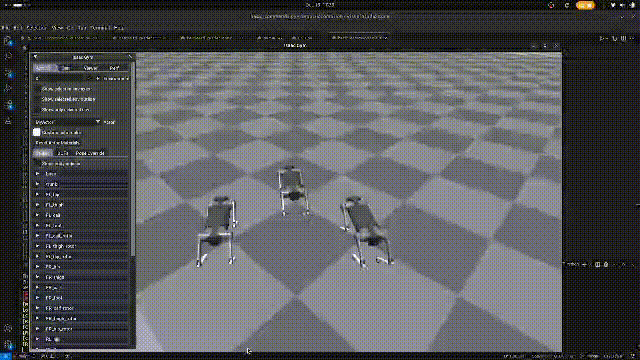
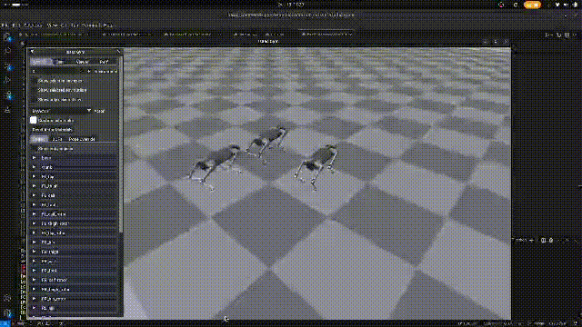

# 3D Simulation Code







## Folder structure
```
├── 0_isaacGym_test1
│   └── basic_anymal_spawn.py
├── 1_IsaacGym_mpc_base
│   ├── RL_MPC_Locomotion_custom.py
│   └── trajectory_lib
│       ├── basic_commands.py
│       ├── __init__.py
│       └── __pycache__
│           ├── basic_commands.cpython-37.pyc
│           └── __init__.cpython-37.pyc
├── Images
│   ├── sequence_3robot.png
│   ├── sequence_mpc_3robots_cleaned.mp4
│   ├── short_sequence_init.gif
│   └── short_sequence_stop.gif
├── notes.txt
└── README.md
```